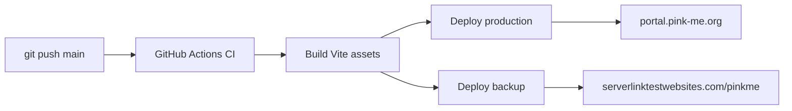

# CI/CD: Git push to `main` deploys this Laravel app to cPanel over SSH.

## How it works



| Workflow | Trigger | Purpose |
|----------|---------|---------|
| `.github/workflows/ci.yml` | Pull requests | Validate Composer + build frontend |
| `.github/workflows/deploy.yml` | Push to `main`, manual | Build, then deploy to **production + backup** cPanel servers in parallel |

---

## One-time server setup (cPanel SSH)

### 1. Enable SSH in cPanel

cPanel → **Security** → **SSH Access** → manage keys or enable shell access for your account.

### 2. Clone the repo on the server

SSH into cPanel, then:

```bash
cd ~
bash -c "$(curl -fsSL https://raw.githubusercontent.com/SaadNaseer06/PinkMe/main/scripts/cpanel-server-init.sh)"
```

Or clone manually:

```bash
git clone -b main https://github.com/SaadNaseer06/PinkMe.git ~/public_html/pinkme
cd ~/public_html/pinkme
cp .env.example .env
php artisan key:generate --force
nano .env   # set APP_URL, DB_*, mail, etc.
chmod -R 775 storage bootstrap/cache
```

### 3. Configure `.env` on the server

Minimum production settings:

```env
APP_ENV=production
APP_DEBUG=false
APP_URL=https://yourdomain.com/pinkme

DB_CONNECTION=mysql
DB_HOST=localhost
DB_DATABASE=...
DB_USERNAME=...
DB_PASSWORD=...
```

See also `DEPLOYMENT.md` and `DEPLOYMENT_CPANEL.md` for `.htaccess` and subdirectory URLs.

### 4. Create a deploy SSH key (no passphrase)

On your **local machine**:

```bash
ssh-keygen -t ed25519 -N "" -f github_deploy -C "github-actions-pinkme"
```

- Add **`github_deploy.pub`** to the server: `~/.ssh/authorized_keys`
- Keep **`github_deploy`** (private key) for GitHub Secrets below

Test from your machine:

```bash
ssh -i github_deploy -p 22 YOUR_CPANEL_USER@YOUR_HOST "echo ok"
```

---

## GitHub repository secrets

In GitHub: **Settings → Secrets and variables → Actions → New repository secret**

### Production (`portal.pink-me.org`)

| Secret | Example | Description |
|--------|---------|-------------|
| `CPANEL_HOST` | `66.29.149.231` or `portal.pink-me.org` | SSH hostname |
| `CPANEL_SSH_PORT` | `22` | SSH port (often 22) |
| `CPANEL_USERNAME` | `portalpinkme` | cPanel account username |
| `CPANEL_SSH_KEY` | Full private key PEM | Deploy key (no passphrase) |
| `DEPLOY_PATH` | `/home/portalpinkme/public_html` | Absolute path to the git repo |
| `DEPLOY_APP_URL` | `https://portal.pink-me.org` | Production URL (no trailing slash) |

### Backup / staging (`serverlinktestwebsites.com/pinkme`)

| Secret | Example | Description |
|--------|---------|-------------|
| `BACKUP_CPANEL_HOST` | `66.29.149.231` or `serverlinktestwebsites.com` | SSH hostname |
| `BACKUP_CPANEL_SSH_PORT` | `22` | SSH port |
| `BACKUP_CPANEL_USERNAME` | `serverlinkitestwe` | cPanel account username |
| `BACKUP_CPANEL_SSH_KEY` | Full private key PEM | Same deploy key or a second key authorized on this account |
| `BACKUP_DEPLOY_PATH` | `/home/serverlinkitestwe/public_html/pinkme` | Absolute path to the git repo |
| `BACKUP_DEPLOY_APP_URL` | `https://serverlinktestwebsites.com/pinkme` | Backup site URL (no trailing slash) |

If backup secrets are missing, that deploy target is **skipped** (production still deploys).

**Important:** SSH keys must be the **private** key, not the `ssh-ed25519 AAAA...` public line. Passphrase-protected keys will not work in CI.

Optional: store the private key as base64 to avoid newline issues:

```bash
base64 -w 0 github_deploy
```

Paste the output into the secret (the workflow accepts PEM or base64).

---

## Backup server one-time setup

SSH into the **serverlinktestwebsites.com** cPanel account:

```bash
git clone -b main https://github.com/SaadNaseer06/PinkMe.git ~/public_html/pinkme
cd ~/public_html/pinkme
cp .env.example .env
/usr/local/bin/ea-php82 artisan key:generate --force
```

Edit `.env`:

```env
APP_ENV=production
APP_DEBUG=false
APP_URL=https://serverlinktestwebsites.com/pinkme
USE_PUBLIC_URL_PREFIX=true
```

Create storage symlink and permissions:

```bash
mkdir -p storage/app/public
ln -sf ../storage/app/public public/storage
chmod -R 775 storage bootstrap/cache
```

Add your GitHub deploy **public** key to `~/.ssh/authorized_keys` (cPanel → SSH Access → Import Key → Authorize).

Test from your PC:

```powershell
ssh -i "$env:USERPROFILE\github_deploy_pinkme" -p 22 serverlinkitestwe@66.29.149.231 "echo ok"
```

Then add the **BACKUP_*** secrets in GitHub (see table above). You can paste the same private key into `BACKUP_CPANEL_SSH_KEY` if it is authorized on both accounts.

---

## Deploy

After secrets are set and the server is initialized:

```bash
git push origin main
```

GitHub Actions will:

1. Build once (Composer validate, `npm run build`)
2. Deploy to **production** and **backup** in parallel (each: `git pull`, `deploy-remote.sh`, upload assets)

Manual deploy: **Actions → Deploy to cPanel → Run workflow**.

---

## Troubleshooting

| Problem | Fix |
|---------|-----|
| Permission denied (publickey) | Verify public key is in server `authorized_keys`; private key in `CPANEL_SSH_KEY` |
| `git fetch` fails on server | Ensure repo exists at `DEPLOY_PATH` and remote is `origin` → GitHub |
| HTTP 500 after deploy | Check `storage/logs/laravel.log`; run `bash scripts/deploy-fix.sh` on server |
| Assets missing | Confirm `DEPLOY_APP_URL` matches `.env`; Vite `public/build` uploaded |
| Migrations fail | Fix DB credentials in server `.env`; run `php artisan migrate --force` manually once |

---

## Files

| File | Role |
|------|------|
| `.github/workflows/deploy.yml` | Production deploy pipeline |
| `.github/workflows/ci.yml` | PR checks + pre-deploy validation |
| `scripts/deploy-remote.sh` | Server-side deploy steps (composer, migrate, cache) |
| `scripts/cpanel-server-init.sh` | First-time git clone on cPanel |
| `scripts/deploy-fix.sh` | Manual repair script on the server |
